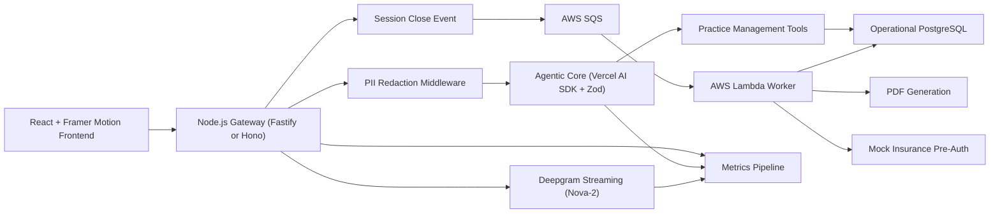

# AuraDent Design Doc

## 1. Overview

AuraDent is a real-time dental documentation and workflow platform for chairside clinical use. It combines a premium ambient frontend, streaming transcription, an agentic tool-calling layer, and an event-driven backend to turn spoken exam notes into structured perio updates, clinical artifacts, and post-visit workflows.

The product goal is to let a dentist speak naturally during an exam while the system:

- transcribes speech in real time,
- extracts structured periodontal and charting data,
- shows transparent agent activity and confidence,
- protects patient privacy before LLM processing,
- and completes slower post-session tasks asynchronously.

## 2. Goals

### Product goals

- Reduce manual charting during hygiene and perio workflows.
- Produce structured, auditable clinical records from natural speech.
- Preserve clinician trust with visible traceability and confidence signals.
- Separate real-time user experience from slower downstream processing.

### Engineering goals

- Keep end-to-end interaction latency low enough for live chairside use.
- Ensure schema-safe outputs for database writes.
- Decouple session wrap-up tasks with an event-driven backend.
- Make observability first-class across transcription, agent, and worker stages.

### Non-goals

- Full EHR replacement.
- Direct production integration with payer APIs in v1.
- Multi-language clinical dictation in the first release.
- Autonomous clinical decision-making.

## 3. Success Criteria

- Time to first tentative transcript under 500 ms in normal conditions.
- Finalized transcript updates visible continuously during speech.
- Structured chart updates succeed without manual correction for the majority of standard perio utterances.
- PII is redacted before LLM provider submission.
- Session close reliably triggers asynchronous enrichment with at-least-once processing semantics.

## 4. User Experience

### Primary user

- Dentist or hygienist performing a live exam.

### Core workflow

1. Clinician opens a patient session.
2. Browser captures microphone audio and streams it to the gateway over WebSocket.
3. Deepgram returns partial and final transcript events.
4. UI renders tentative text in muted styling and final text in solid styling.
5. Agent consumes redacted transcript segments, calls tools, and emits structured updates.
6. Animated cards flow into the digital dental chart as findings are confirmed.
7. On session close, the gateway publishes a finalized session payload to SQS.
8. Lambda performs downstream enrichment and persistence tasks.

## 5. High-Level Architecture



## 6. Frontend Design

### Stack

- React for application UI and local state orchestration.
- Framer Motion for layout animations, card transitions, and trace panel transitions.
- Canvas-based waveform renderer driven by microphone energy levels and transcript timing.

### Primary surfaces

#### Ambient dashboard

- High-end clinical terminal aesthetic with dense but calm information layout.
- Center pane for live transcript and session timeline.
- Right or lower panel for live dental chart updates.
- Persistent mic state, connection state, and latency indicators.

#### Waveform visualizer

- Canvas-based waveform reacts to microphone input amplitude.
- Visual style should feel medical-grade and precise rather than entertainment-oriented.
- Degrades gracefully when audio permissions are denied or unavailable.

#### Live transcript

- Partial results rendered in gray or reduced opacity.
- Finalized results “crystallize” into solid black text when confirmed.
- Token replacement should avoid jarring reflows by grouping transcript segments into stable utterance blocks.

#### Dental chart animation

- Extracted findings become cards such as `Tooth #14`, `Pocket Depth 4mm`, or `Bleeding on Probing`.
- Framer Motion layout animations move cards from the transcript context into the chart region.
- Only high-confidence findings auto-commit visually; lower-confidence findings can remain staged for review.

#### Trace view

- Sidebar that displays the agent’s operational trace, not hidden chain-of-thought.
- Events include:
  - transcript received,
  - PII redacted,
  - tool invoked,
  - tool result received,
  - schema validation passed or failed,
  - confidence score emitted.
- This improves operator trust and supports debugging without exposing sensitive raw internals.

### Frontend state model

- `sessionState`: idle, listening, paused, reconnecting, closing, closed.
- `audioState`: permission, input level, websocket connectivity.
- `transcriptState`: partial segments, finalized segments, speaker timestamps.
- `agentState`: pending tasks, tool events, structured findings, confidence summaries.
- `chartState`: staged findings, committed findings, review-needed findings.
- `metricsState`: TTFT, transcription latency, agent turn latency.

## 7. Real-Time Pipeline

### Gateway responsibilities

The Node.js/TypeScript gateway is the control plane for the live session:

- accepts browser WebSocket connections,
- authenticates session and user context,
- receives browser audio chunks,
- forwards audio stream to Deepgram,
- receives partial/final transcript events,
- passes transcript text through PII redaction,
- invokes the agentic layer,
- streams transcript, trace, and chart updates back to the UI,
- publishes a final session event on close.

### Transport

- Browser to gateway: secure WebSocket.
- Gateway to Deepgram: streaming WebSocket.
- Gateway to frontend: bidirectional session event channel over the same WebSocket.

### Partial results handling

AuraDent should treat transcript updates as a stream of revisions, not append-only text.

#### Approach

- Assign each utterance a stable client-visible ID.
- Render partial tokens as tentative text.
- Replace only the affected utterance block when Deepgram sends higher-confidence revisions.
- Mark utterance block as finalized only when the provider indicates final confirmation.

#### Why this matters

- Prevents duplicate or flickering text.
- Lets downstream extraction distinguish between tentative and final content.
- Supports better UX for “crystallizing” text effects and chart animations.

### Recommended event types

```ts
type RealtimeEvent =
  | { type: 'session.started'; sessionId: string }
  | { type: 'audio.level'; level: number; ts: string }
  | { type: 'transcript.partial'; utteranceId: string; text: string; ts: string }
  | { type: 'transcript.final'; utteranceId: string; text: string; ts: string }
  | { type: 'trace.event'; step: string; detail: string; confidence?: number; ts: string }
  | { type: 'chart.finding.staged'; findingId: string; payload: unknown; ts: string }
  | { type: 'chart.finding.committed'; findingId: string; payload: unknown; ts: string }
  | { type: 'metric'; name: string; value: number; unit: string; ts: string }
  | { type: 'session.closed'; sessionId: string; ts: string };
```

## 8. Agentic Core

### Stack

- Vercel AI SDK for model orchestration and tool calling.
- Zod for strict structured output validation.
- Practice management tools implemented as typed server-side functions.

### Responsibilities

- Consume redacted transcript text and clinical context.
- Decide when tool calls are needed.
- Produce validated structured findings for chart updates and persistence.
- Emit trace events for transparency and debugging.

### Tooling model

Example practice management tools:

- `check_patient_history(patientId)`
- `get_active_treatment_plan(patientId)`
- `update_perio_chart(sessionId, findings)`
- `flag_medication_contraindication(patientId, medication)`
- `save_clinical_note_draft(sessionId, note)`

### Structured output contract

The agent should never write raw freeform JSON directly to persistence. Instead:

1. The model proposes structured output.
2. Zod validates the payload.
3. Valid payloads are normalized by an ingestion service.
4. Only normalized data is written to PostgreSQL.

### Example schema direction

The earlier schema referenced in project planning is not present in this workspace, so this design uses a representative schema contract that should be aligned to the canonical version during implementation.

```ts
import { z } from 'zod';

export const PerioFindingSchema = z.object({
  toothNumber: z.number().int().min(1).max(32),
  site: z.enum(['MB', 'B', 'DB', 'ML', 'L', 'DL']).optional(),
  probingDepthMm: z.number().int().min(1).max(15).optional(),
  bleedingOnProbing: z.boolean().optional(),
  gingivalRecessionMm: z.number().int().min(0).max(10).optional(),
  furcationGrade: z.enum(['I', 'II', 'III']).optional(),
  mobilityGrade: z.enum(['0', '1', '2', '3']).optional(),
  confidence: z.number().min(0).max(1),
  sourceUtteranceId: z.string(),
});

export const AgentExtractionSchema = z.object({
  sessionId: z.string(),
  patientId: z.string(),
  findings: z.array(PerioFindingSchema),
  noteSummary: z.string().optional(),
  requiresReview: z.boolean().default(false),
});
```

### Confidence and review policy

- High-confidence findings can auto-stage or auto-commit.
- Medium-confidence findings should stage with UI review affordances.
- Low-confidence findings should remain in trace output and not mutate the chart automatically.

## 9. Privacy and Safety

### PII redaction middleware

This middleware sits between transcription output and the LLM provider.

#### Responsibilities

- detect direct identifiers such as names, SSNs, phone numbers, and addresses,
- replace them with structured placeholders before provider submission,
- maintain a local reversible mapping for authorized downstream system use,
- emit trace events such as `PII redacted: patient_name`.

#### Example

- Raw transcript: “John Smith has 4 millimeter pockets on 14.”
- Redacted transcript to LLM: “[PATIENT_NAME] has 4 millimeter pockets on 14.”

### Guardrail policy

- No raw identifiers sent to the model provider.
- No direct autonomous database writes from unvalidated model output.
- Tool execution only from allowlisted server-side functions.
- Full audit trail of redaction, validation, and write actions.

## 10. Data Intelligence Layer

### Ingestion service

The ingestion service transforms agent-generated structured findings into normalized PostgreSQL records.

### Responsibilities

- map messy or incomplete agent payloads into canonical relational tables,
- deduplicate repeated findings across partial/final transcript revisions,
- enforce referential integrity,
- preserve provenance from utterance to stored record,
- support replay from session artifacts when normalization logic changes.

### Why this exists

The agent should optimize for extracting meaning from speech, while the ingestion layer should optimize for database correctness. Keeping these concerns separate reduces brittleness and makes schema evolution safer.

## 11. Event-Driven Backend

### Session close flow

When a session is closed:

1. Gateway assembles the final session payload.
2. Payload is written to AWS SQS.
3. Lambda is triggered asynchronously.
4. Lambda performs enrichment and persistence.

### Worker responsibilities

- Generate a post-op instruction PDF.
- Simulate an insurance pre-authorization request against a mock provider.
- Persist final enriched session record into PostgreSQL.

### Rationale for SQS

- Prevents slow downstream work from blocking the real-time chairside flow.
- Improves resilience through retry and dead-letter queue patterns.
- Allows future fan-out into analytics, notifications, or compliance pipelines.

### Message contract

```json
{
  "sessionId": "sess_123",
  "patientId": "pat_456",
  "closedAt": "2026-04-21T16:30:00Z",
  "transcript": {
    "finalText": "Patient has 4 millimeter pockets on 14."
  },
  "structuredFindings": [
    {
      "toothNumber": 14,
      "probingDepthMm": 4,
      "confidence": 0.96,
      "sourceUtteranceId": "utt_22"
    }
  ],
  "artifacts": {
    "trace": [],
    "metrics": []
  }
}
```

### Failure handling

- SQS retries transient Lambda failures.
- DLQ captures poison messages for investigation.
- Idempotency key should be `sessionId` plus a version or close timestamp.
- Final persistence must be safe under at-least-once delivery.

## 12. PostgreSQL Data Model

### Core entities

- `patients`
- `sessions`
- `transcript_utterances`
- `agent_findings`
- `perio_chart_measurements`
- `session_artifacts`
- `insurance_preauth_requests`
- `generated_documents`

### Suggested relationships

- One patient has many sessions.
- One session has many transcript utterances.
- One session has many agent findings.
- One finding may produce one or more normalized perio measurements.
- One session may have many generated artifacts.

### Design principles

- Store raw-ish session artifacts for audit and replay.
- Store normalized clinical tables for application queries.
- Preserve source provenance on every structured write.

## 13. Observability and Performance

### Metrics dashboard

The system should expose a lightweight metrics view showing:

- TTFT for transcription and agent response,
- transcription partial latency,
- transcription finalization latency,
- tool-call latency,
- schema validation success rate,
- session close to worker completion time.

### Recommended tracing points

- browser mic start,
- websocket open,
- first audio chunk received,
- first Deepgram partial,
- first Deepgram final,
- transcript redacted,
- agent invoked,
- tool start and end,
- zod validation pass or fail,
- chart update emitted,
- session close published to SQS,
- Lambda completion.

### Operational logging

- Use structured logs with `sessionId`, `patientId`, `utteranceId`, and `traceId`.
- Never log raw PII in provider-facing or shared observability sinks.

## 14. Infrastructure as Code

### Recommended choice

AWS CDK is the stronger long-term fit if the team expects infrastructure growth and typed infrastructure definitions. Serverless Framework is acceptable if the priority is fast Lambda/SQS iteration with lighter setup.

### Managed resources

- SQS queue for session wrap-up jobs.
- SQS DLQ.
- Lambda worker function.
- IAM roles and least-privilege policies.
- CloudWatch logs and alarms.
- Secrets configuration for database credentials and third-party tokens.

### Deployment scope

- Real-time gateway can be deployed separately from AWS worker infrastructure.
- CDK or Serverless should own only the AWS event-driven components in the initial phase.

## 15. API and Service Boundaries

### Browser to gateway

- `WS /realtime/session/:sessionId`
- Client sends audio frames and control events.
- Server sends transcript, trace, chart, and metrics events.

### Gateway internal modules

- `audio-stream-service`
- `deepgram-client`
- `transcript-revision-manager`
- `pii-redaction-middleware`
- `agent-orchestrator`
- `tool-registry`
- `metrics-emitter`
- `session-close-publisher`

### Worker modules

- `pdf-generator`
- `insurance-preauth-client`
- `session-persistence-service`

## 16. Security Considerations

- Authenticate every session with scoped access tokens.
- Use TLS for browser, gateway, provider, and AWS traffic.
- Encrypt stored artifacts and generated PDFs at rest.
- Apply least-privilege IAM for SQS and Lambda.
- Separate runtime secrets by environment.
- Ensure auditability for every clinical mutation.

## 17. Rollout Plan

### Phase 1: Interactive skeleton

- Build React dashboard shell and waveform visualization.
- Establish browser-to-gateway WebSocket session.
- Stream audio to Deepgram and render partial/final transcript states.

### Phase 2: Structured extraction

- Add PII redaction middleware.
- Integrate Vercel AI SDK tool-calling flow.
- Validate outputs with Zod and animate chart cards into place.

### Phase 3: Persistence and ingestion

- Implement normalization service and PostgreSQL persistence.
- Add trace view and confidence policies.
- Add metrics dashboard.

### Phase 4: Event-driven closeout

- Publish close-session payloads to SQS.
- Implement Lambda PDF, mock insurance, and final enrichment flow.
- Add retries, DLQ, and operational dashboards.

## 18. Risks and Mitigations

### Transcript instability

- Risk: partial transcript revisions create duplicate or incorrect chart updates.
- Mitigation: separate tentative versus final utterances and gate commits by confidence and finalization state.

### Over-extraction by the agent

- Risk: model infers unsupported findings from ambiguous speech.
- Mitigation: strict schema validation, confidence thresholds, and human-review states.

### Privacy leakage

- Risk: raw PII reaches model providers or logs.
- Mitigation: mandatory redaction middleware, redaction audit events, and logging hygiene.

### Slow session close tasks

- Risk: downstream tasks degrade the live experience.
- Mitigation: decouple via SQS and treat enrichment as asynchronous.

### Schema drift

- Risk: LLM output shape diverges from database expectations.
- Mitigation: Zod contracts plus a dedicated normalization layer with replay support.

## 19. Open Questions

- Which model provider will back the Vercel AI SDK orchestration layer?
- Will tooth numbering support only Universal notation in v1, or also FDI?
- What confidence threshold qualifies for auto-commit versus review?
- Should the trace view be clinician-facing in production, or operator/debug only?
- What retention period is required for raw transcripts, traces, and generated documents?

## 20. Recommended MVP Scope

The MVP should focus on a single high-value perio workflow:

- real-time audio streaming,
- partial and final transcript rendering,
- extraction of probing depth findings,
- animated chart updates,
- trace visibility,
- session-close enqueue,
- Lambda-generated PDF and mock insurance call,
- normalized PostgreSQL persistence.

This keeps the initial scope narrow while still demonstrating the full architectural story: ambient UX, streaming intelligence, schema-safe agents, privacy middleware, and event-driven completion.
